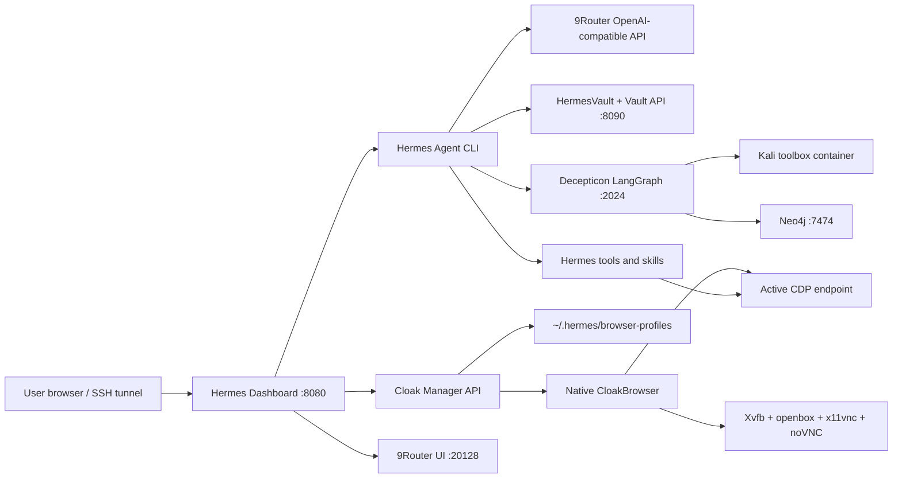

<p align="center">
  
</p>

<h1 align="center">Hermes Ultimate</h1>

<p align="center">
  A self-hosted operator stack for Hermes Agent: dashboard, model routing, native CloakBrowser profiles,
  vault storage, Telegram gateways, and Decepticon research workflows.
</p>

<p align="center">
  <a href="README.md">English</a>
  ·
  <a href="README.ru.md">Русский</a>
  ·
  <a href="README.zh-CN.md">中文</a>
</p>

<p align="center">
  
  
  
  
</p>

---

## Overview

Hermes Ultimate packages Hermes Agent as an always-on private workstation for automation and operator workflows. The
agent runs natively in Python; Docker Compose provides the supporting services around it. The browser layer is native:
the dashboard launches persistent CloakBrowser profiles directly on the host and streams each desktop through noVNC.

This repository is tuned for a fresh VPS install, but it also works on WSL2 Ubuntu and local Linux workstations.

```bash
curl -fsSL https://raw.githubusercontent.com/Iwakishirokoshu/HermesUltimate/main/install | bash -s -- --defaults
```

## What Is Included

| Area | What Hermes Ultimate provides |
| --- | --- |
| Agent runtime | Hermes CLI, dashboard, sessions, tools, souls, cron, gateway commands |
| Model routing | 9Router as the local OpenAI-compatible provider gateway |
| Browser automation | Native CloakHQ patched Chromium profiles, CDP bridge, embedded noVNC workspace |
| Persistent storage | HermesVault plus a local Vault API for files, sessions, and engagement data |
| Security research | Optional Decepticon/LangGraph backend with an isolated Kali-based Docker sandbox |
| Messaging | Telegram gateway and optional second bot mode |
| Operations | One-command installer, generated env files, loopback-bound services, Caddy/Tailscale options |

## Architecture



## Quick Start

### Fresh VPS

```bash
curl -fsSL https://raw.githubusercontent.com/Iwakishirokoshu/HermesUltimate/main/install | bash -s -- --defaults
```

### Interactive Wizard

```bash
curl -fsSL https://raw.githubusercontent.com/Iwakishirokoshu/HermesUltimate/main/install | bash
```

### Local Checkout

```bash
git clone https://github.com/Iwakishirokoshu/HermesUltimate.git
cd HermesUltimate
./install
```

### Private Fork Or Branch

```bash
curl -fsSL https://raw.githubusercontent.com/Iwakishirokoshu/HermesUltimate/main/install | bash -s -- \
  --repo-url https://github.com/Iwakishirokoshu/HermesUltimate.git \
  --branch main
```

### Private Repository Token

```bash
export HERMES_GITHUB_TOKEN="<github-token-with-repo-read-access>"
curl -fsSL -H "Authorization: Bearer $HERMES_GITHUB_TOKEN" \
  https://raw.githubusercontent.com/Iwakishirokoshu/HermesUltimate/main/install \
  | HERMES_GITHUB_TOKEN="$HERMES_GITHUB_TOKEN" bash -s -- --defaults
```

## Default Services

| Component | Purpose | Default endpoint |
| --- | --- | --- |
| Hermes CLI | Native agent runtime and command-line entrypoint | `hermes` |
| Dashboard | Web control panel | `http://localhost:8080` |
| 9Router | OpenAI-compatible model/provider router | `http://localhost:20128` |
| Vault API | Local API for HermesVault | `http://localhost:8090` |
| Cloak Manager | Native browser profiles and embedded noVNC | Dashboard `Browser` page |
| Decepticon | Optional LangGraph security-research backend | `http://localhost:2024` |
| Neo4j | Optional graph backend for Decepticon | `http://localhost:7474` |
| Telegram Gateway | Optional bot configuration | `~/.hermes/gateway.yaml` |

On VPS installs, public-facing services are loopback-bound by default. Use SSH tunnels, Tailscale, or the Caddy overlay
for remote access.

## Stack Profiles

| Profile | Includes | Recommended for |
| --- | --- | --- |
| `slim` | Core stack, Decepticon/LangGraph, Neo4j | Default VPS install |
| `ultra-slim` | Core stack only | Hermes, 9Router, Vault, and Cloak without research services |
| `full` | Currently aliases to `slim` | Reserved for future expansion |

Default install values:

```text
mode:        vps
profile:     slim
branch:      main
vault path:  ~/HermesVault
install dir: /opt/hermes-ultimate
```

## Requirements

Recommended VPS:

| Resource | Recommended |
| --- | --- |
| OS | Ubuntu 22.04 LTS or newer |
| CPU | 4 vCPU |
| RAM | 6 GB |
| Disk | 80 GB NVMe |
| Network | Public IPv4 if you plan to expose Caddy or Tailscale endpoints |

The Linux installer validates Docker/Compose and performs a best-effort apt install when running as root. It also
installs the native Cloak desktop runtime: Xvfb, openbox, x11vnc, websockify, noVNC, fonts, and Chromium system
libraries.

Windows is supported through Docker Desktop plus WSL2/Git Bash style tooling. Native Cloak profile launch is designed
for Linux VPS/WSL environments.

## Installer Options

`./install` is the user-facing entrypoint. It delegates to `./install.sh`, which can also be called directly:

```bash
./install.sh \
  --mode vps \
  --profile slim \
  --vault-path ~/HermesVault \
  --repo-url https://github.com/Iwakishirokoshu/HermesUltimate.git \
  --branch main \
  --non-interactive
```

Common flags:

```text
--mode local|vps
--profile slim|full|ultra-slim
--vnc-password <password>
--with-second-bot
--with-tailscale
--vault-path <path>
--repo-url <url>
--branch <name>
--non-interactive
--defaults
--skip-stack
```

In `--defaults` or `--non-interactive` mode, secrets are generated locally, Docker services are started, 9Router
password login is disabled behind loopback, and the credential wizard is skipped.

## First Run

Open the dashboard locally:

```text
http://localhost:8080
```

On a VPS, tunnel the dashboard and router:

```bash
ssh -N \
  -L 127.0.0.1:8080:127.0.0.1:8080 \
  -L 127.0.0.1:20128:127.0.0.1:20128 \
  root@YOUR_SERVER_IP
```

Then open:

```text
Dashboard: http://localhost:8080
9Router:   http://localhost:20128
```

Cloak desktops are proxied through the dashboard Browser page, so no public VNC port is required.

## Native CloakBrowser Manager

Hermes Ultimate uses the official CloakHQ `cloakbrowser` Python package and its patched Chromium binary. CloakHQ's
browser patches are compiled into Chromium; Hermes does not rely on JavaScript stealth injection.

The dashboard `Browser` page can:

- create persistent browser profiles with fingerprint seeds, proxy, locale, timezone, viewport, GeoIP, humanize preset,
  and raw CloakBrowser flags;
- launch or stop profiles without Docker;
- stream a launched profile through embedded noVNC;
- mark one running profile as the active Hermes browser for CDP tools and skills.

Profile state lives outside the repository:

```text
~/.hermes/cloak/profiles.db
~/.hermes/cloak/active_profile.json
~/.hermes/browser-profiles/<profile-id>/
```

The active profile's CDP endpoint is discovered automatically:

```env
CLOAK_CDP_URL=auto
BROWSER_CDP_URL=auto
HERMES_CLOAK_MANAGER_PATH=~/.hermes/cloak
HERMES_BROWSER_PROFILES=~/.hermes/browser-profiles
```

Use an explicit URL only when you want to override the manager:

```env
CLOAK_CDP_URL=http://127.0.0.1:9222
```

Useful per-profile CloakBrowser flags:

```text
--fingerprint-storage-quota=5000
--fingerprint-webrtc-ip=auto
--fingerprint-platform=windows
```

The legacy Docker `vnc-cloak` service is still available, but only when explicitly requested:

```bash
COMPOSE_PROFILES=legacy-cloak docker compose -f stack/docker-compose.yml up -d vnc-cloak
```

## 9Router

Hermes Ultimate uses 9Router as the local OpenAI-compatible gateway for Hermes and Decepticon.

```text
Host API:      http://localhost:20128/v1
Container API: http://9router:20128/v1
Env:           NINEROUTER_BASE_URL=http://localhost:20128/v1
```

The stack disables 9Router password login after startup and binds the service to loopback. The installer generates
`NINEROUTER_API_KEY` in `~/.hermes/stack.env`; provider credentials are added through the 9Router UI.

## Decepticon And Kali Sandbox

The Decepticon profile starts a sandbox container based on `kalilinux/kali-rolling`. It does not install Kali Linux on
the host. Your VPS remains its normal OS; Kali tooling lives inside Docker.

The sandbox provides isolated tooling for authorized security research:

- recon tools such as `nmap`, `dnsutils`, `whois`, `subfinder`;
- web/security tools such as `sqlmap`, `nikto`, `gobuster`, `hydra`;
- AD/internal-network tools such as `impacket`, `responder`, `smbclient`;
- mobile and triage tools such as `adb`, `apktool`, `yara`;
- Python, Node, tmux, and the sandbox daemon used by Decepticon.

Use this stack only on systems, labs, programs, and assets where you have permission to test.

## Security Model

| Boundary | Default behavior |
| --- | --- |
| Service binding | VPS services bind to `127.0.0.1` by default |
| Secrets | Generated under `~/.hermes`, never stored in the repository |
| Browser profiles | Stored under `~/.hermes/browser-profiles` |
| Cloak CDP | Active profile URL is local and selected by the dashboard |
| noVNC | Static assets are public; profile websocket is token/ticket gated |
| Caddy | Optional overlay for HTTPS, intended to be paired with auth or Tailscale |

Generated local state:

```text
~/.hermes/stack.env
~/.hermes/gateway.yaml
~/.hermes/config.toml
~/.hermes/dashboard.pid
~/.hermes/cloak/
~/.hermes/browser-profiles/
~/.hermes/logs/
~/HermesVault/
```

## Operations

Check running services:

```bash
cd /opt/hermes-ultimate
docker compose -f stack/docker-compose.yml -f stack/docker-compose.decepticon-slim.yml ps
```

Restart the Docker stack:

```bash
cd /opt/hermes-ultimate
docker compose -f stack/docker-compose.yml -f stack/docker-compose.decepticon-slim.yml up -d --build
bash scripts/disable-9router-auth.sh
```

Start the dashboard manually:

```bash
hermes dashboard --host 127.0.0.1 --port 8080 --no-open
```

Update from Git:

```bash
cd /opt/hermes-ultimate
git pull --ff-only origin main
./install.sh --defaults
```

## VPS TLS And Remote Access

For public HTTPS, use the Caddy overlay and protect it with Caddy basic auth, OAuth, or Tailscale-only access:

```bash
cd /opt/hermes-ultimate
docker compose \
  -f stack/docker-compose.yml \
  -f stack/docker-compose.decepticon-slim.yml \
  -f stack/docker-compose.vps.yml \
  up -d
```

Caddy can proxy:

```text
https://dashboard.<domain> -> localhost:8080
https://router.<domain>    -> localhost:20128
```

Set Caddy variables in `~/.hermes/stack.env`; see `docs/README-stack.md` for production overlay notes.

## Troubleshooting

Docker services:

```bash
docker ps
docker compose -f stack/docker-compose.yml -f stack/docker-compose.decepticon-slim.yml logs --tail=100
```

9Router password prompt:

```bash
cd /opt/hermes-ultimate
bash scripts/disable-9router-auth.sh
```

Cloak dependency check:

```bash
python - <<'PY'
from hermes_cli.cloak_native import dependency_status
print(dependency_status())
PY
```

If Cloak launch fails, rerun `./install.sh --defaults` as root or install the missing packages reported by the
dependency check.

If Telegram validation fails, send `/start` to the bot first and rerun the post-install wizard.

## Development Checks

```bash
bash -n install install.sh scripts/install.sh scripts/gen-env.sh scripts/post-install-wizard.sh scripts/disable-9router-auth.sh
docker compose -f stack/docker-compose.yml config
docker compose -f stack/docker-compose.yml -f stack/docker-compose.decepticon-slim.yml config
python -m pytest tests/tools/test_cloak_cdp_layer.py -v
npm --prefix web run build
```

## License

Hermes Ultimate is released under the MIT License. See `LICENSE`.
