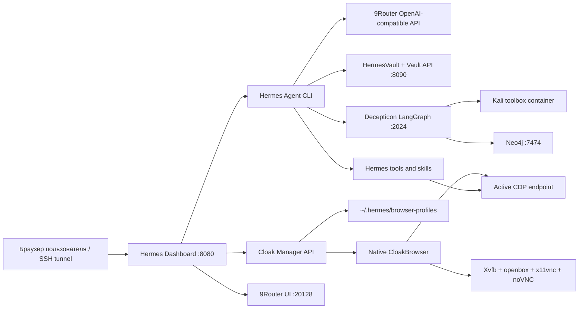

<p align="center">
  
</p>

<h1 align="center">Hermes Ultimate</h1>

<p align="center">
  Самостоятельный операторский стек для Hermes Agent: дашборд, маршрутизация моделей,
  native CloakBrowser-профили, vault-хранилище, Telegram-шлюзы и Decepticon workflow.
</p>

<p align="center">
  <a href="README.md">English</a>
  ·
  <a href="README.ru.md">Русский</a>
  ·
  <a href="README.zh-CN.md">中文</a>
</p>

<p align="center">
  
  
  
  
</p>

---

## Что Это

Hermes Ultimate собирает Hermes Agent в приватную рабочую станцию для автоматизации и операторских сценариев. Сам
агент работает нативно в Python; Docker Compose поднимает инфраструктурные сервисы вокруг него. Браузерный слой тоже
нативный: дашборд запускает постоянные CloakBrowser-профили прямо на сервере и показывает каждый рабочий стол через
noVNC.

Репозиторий рассчитан на установку на чистый VPS, но также подходит для WSL2 Ubuntu и локальной Linux-машины.

```bash
curl -fsSL https://raw.githubusercontent.com/Iwakishirokoshu/HermesUltimate/main/install | bash -s -- --defaults
```

## Что Внутри

| Область | Что даёт Hermes Ultimate |
| --- | --- |
| Agent runtime | Hermes CLI, дашборд, сессии, tools, souls, cron, gateway-команды |
| Модели | 9Router как локальный OpenAI-compatible шлюз провайдеров |
| Браузер | Native CloakHQ patched Chromium profiles, CDP bridge, встроенный noVNC workspace |
| Хранилище | HermesVault и локальный Vault API для файлов, сессий и engagement-данных |
| Security research | Опциональный Decepticon/LangGraph backend с изолированным Kali Docker sandbox |
| Мессенджеры | Telegram gateway и режим второго бота |
| Эксплуатация | One-command installer, generated env, loopback-bound сервисы, Caddy/Tailscale options |

## Архитектура



## Быстрый Старт

### Чистый VPS

```bash
curl -fsSL https://raw.githubusercontent.com/Iwakishirokoshu/HermesUltimate/main/install | bash -s -- --defaults
```

### Интерактивный Мастер

```bash
curl -fsSL https://raw.githubusercontent.com/Iwakishirokoshu/HermesUltimate/main/install | bash
```

### Локальный Checkout

```bash
git clone https://github.com/Iwakishirokoshu/HermesUltimate.git
cd HermesUltimate
./install
```

### Форк Или Другая Ветка

```bash
curl -fsSL https://raw.githubusercontent.com/Iwakishirokoshu/HermesUltimate/main/install | bash -s -- \
  --repo-url https://github.com/Iwakishirokoshu/HermesUltimate.git \
  --branch main
```

### Приватный Репозиторий

```bash
export HERMES_GITHUB_TOKEN="<github-token-with-repo-read-access>"
curl -fsSL -H "Authorization: Bearer $HERMES_GITHUB_TOKEN" \
  https://raw.githubusercontent.com/Iwakishirokoshu/HermesUltimate/main/install \
  | HERMES_GITHUB_TOKEN="$HERMES_GITHUB_TOKEN" bash -s -- --defaults
```

## Сервисы По Умолчанию

| Компонент | Назначение | Endpoint |
| --- | --- | --- |
| Hermes CLI | Нативный agent runtime и CLI entrypoint | `hermes` |
| Dashboard | Веб-панель управления | `http://localhost:8080` |
| 9Router | OpenAI-compatible router моделей и провайдеров | `http://localhost:20128` |
| Vault API | Локальный API для HermesVault | `http://localhost:8090` |
| Cloak Manager | Native browser profiles и embedded noVNC | Dashboard `Browser` page |
| Decepticon | Опциональный LangGraph backend для security research | `http://localhost:2024` |
| Neo4j | Опциональный graph backend для Decepticon | `http://localhost:7474` |
| Telegram Gateway | Конфигурация бота | `~/.hermes/gateway.yaml` |

На VPS все публично чувствительные сервисы по умолчанию слушают `127.0.0.1`. Для доступа извне используй SSH tunnel,
Tailscale или Caddy overlay.

## Профили Стека

| Профиль | Что включает | Когда выбирать |
| --- | --- | --- |
| `slim` | Core stack, Decepticon/LangGraph, Neo4j | Рекомендуемый VPS-вариант |
| `ultra-slim` | Только core stack | Hermes, 9Router, Vault и Cloak без research-сервисов |
| `full` | Сейчас равен `slim` | Зарезервирован под расширенный стек |

Значения по умолчанию:

```text
mode:        vps
profile:     slim
branch:      main
vault path:  ~/HermesVault
install dir: /opt/hermes-ultimate
```

## Требования

Рекомендуемый VPS:

| Ресурс | Рекомендация |
| --- | --- |
| OS | Ubuntu 22.04 LTS или новее |
| CPU | 4 vCPU |
| RAM | 6 GB |
| Disk | 80 GB NVMe |
| Network | Public IPv4, если планируется Caddy или Tailscale endpoint |

Linux installer проверяет Docker/Compose и, если запущен от root, пытается поставить системные зависимости сам. Также
ставятся native Cloak desktop deps: Xvfb, openbox, x11vnc, websockify, noVNC, fonts и Chromium system libraries.

Windows поддерживается через Docker Desktop плюс WSL2/Git Bash tooling. Запуск native Cloak-профилей рассчитан на Linux
VPS/WSL окружение.

## Опции Инсталлятора

`./install` это основной user-facing entrypoint. Он вызывает `./install.sh`, который можно запускать напрямую:

```bash
./install.sh \
  --mode vps \
  --profile slim \
  --vault-path ~/HermesVault \
  --repo-url https://github.com/Iwakishirokoshu/HermesUltimate.git \
  --branch main \
  --non-interactive
```

Частые флаги:

```text
--mode local|vps
--profile slim|full|ultra-slim
--vnc-password <password>
--with-second-bot
--with-tailscale
--vault-path <path>
--repo-url <url>
--branch <name>
--non-interactive
--defaults
--skip-stack
```

В режиме `--defaults` или `--non-interactive` секреты генерируются локально, Docker services стартуют автоматически,
парольный вход в 9Router отключается за loopback, а credential wizard пропускается.

## Первый Запуск

Открой дашборд локально:

```text
http://localhost:8080
```

На VPS пробрось дашборд и роутер:

```bash
ssh -N \
  -L 127.0.0.1:8080:127.0.0.1:8080 \
  -L 127.0.0.1:20128:127.0.0.1:20128 \
  root@YOUR_SERVER_IP
```

Потом открой:

```text
Dashboard: http://localhost:8080
9Router:   http://localhost:20128
```

Cloak desktops проксируются через Dashboard -> Browser, поэтому отдельный публичный VNC-порт не нужен.

## Native CloakBrowser Manager

Hermes Ultimate использует официальный Python package `cloakbrowser` от CloakHQ и patched Chromium binary. Патчи
CloakHQ встроены в Chromium на уровне бинаря; Hermes не делает stealth через JavaScript injection.

Страница Dashboard `Browser` умеет:

- создавать persistent browser profiles с fingerprint seed, proxy, locale, timezone, viewport, GeoIP, humanize preset и
  raw CloakBrowser flags;
- запускать и останавливать профили без Docker;
- показывать запущенный профиль через embedded noVNC;
- назначать один running profile активным браузером Hermes для CDP tools и skills.

Состояние профилей хранится вне репозитория:

```text
~/.hermes/cloak/profiles.db
~/.hermes/cloak/active_profile.json
~/.hermes/browser-profiles/<profile-id>/
```

CDP активного профиля находится автоматически:

```env
CLOAK_CDP_URL=auto
BROWSER_CDP_URL=auto
HERMES_CLOAK_MANAGER_PATH=~/.hermes/cloak
HERMES_BROWSER_PROFILES=~/.hermes/browser-profiles
```

Явный URL нужен только если надо обойти manager и подключить внешний браузер:

```env
CLOAK_CDP_URL=http://127.0.0.1:9222
```

Полезные CloakBrowser flags для профилей:

```text
--fingerprint-storage-quota=5000
--fingerprint-webrtc-ip=auto
--fingerprint-platform=windows
```

Старый Docker `vnc-cloak` оставлен как legacy fallback и запускается только явно:

```bash
COMPOSE_PROFILES=legacy-cloak docker compose -f stack/docker-compose.yml up -d vnc-cloak
```

## 9Router

Hermes Ultimate использует 9Router как локальный OpenAI-compatible gateway для Hermes и Decepticon.

```text
Host API:      http://localhost:20128/v1
Container API: http://9router:20128/v1
Env:           NINEROUTER_BASE_URL=http://localhost:20128/v1
```

Стек отключает password login в 9Router после старта и биндет сервис на loopback. Инсталлятор генерирует
`NINEROUTER_API_KEY` в `~/.hermes/stack.env`; credentials провайдеров добавляются через UI 9Router.

## Decepticon И Kali Sandbox

Профиль Decepticon запускает sandbox container на базе `kalilinux/kali-rolling`. Kali Linux не устанавливается на хост.
VPS остаётся обычной Ubuntu/Debian системой; Kali tooling живёт только внутри Docker.

Sandbox даёт изолированные инструменты для разрешённого security research:

- recon tools: `nmap`, `dnsutils`, `whois`, `subfinder`;
- web/security tools: `sqlmap`, `nikto`, `gobuster`, `hydra`;
- AD/internal-network tools: `impacket`, `responder`, `smbclient`;
- mobile и triage tools: `adb`, `apktool`, `yara`;
- Python, Node, tmux и sandbox daemon для Decepticon.

Используй этот стек только на системах, лабораториях, программах и активах, где у тебя есть разрешение на тестирование.

## Модель Безопасности

| Граница | Поведение по умолчанию |
| --- | --- |
| Service binding | VPS-сервисы слушают `127.0.0.1` |
| Secrets | Генерируются в `~/.hermes`, не хранятся в репозитории |
| Browser profiles | Хранятся в `~/.hermes/browser-profiles` |
| Cloak CDP | Локальный URL активного профиля выбирается дашбордом |
| noVNC | Static assets публичные, profile websocket закрыт token/ticket auth |
| Caddy | Опциональный HTTPS overlay, рассчитан на auth или Tailscale |

Локальное состояние:

```text
~/.hermes/stack.env
~/.hermes/gateway.yaml
~/.hermes/config.toml
~/.hermes/dashboard.pid
~/.hermes/cloak/
~/.hermes/browser-profiles/
~/.hermes/logs/
~/HermesVault/
```

## Эксплуатация

Проверить сервисы:

```bash
cd /opt/hermes-ultimate
docker compose -f stack/docker-compose.yml -f stack/docker-compose.decepticon-slim.yml ps
```

Перезапустить Docker stack:

```bash
cd /opt/hermes-ultimate
docker compose -f stack/docker-compose.yml -f stack/docker-compose.decepticon-slim.yml up -d --build
bash scripts/disable-9router-auth.sh
```

Запустить dashboard вручную:

```bash
hermes dashboard --host 127.0.0.1 --port 8080 --no-open
```

Обновиться из Git:

```bash
cd /opt/hermes-ultimate
git pull --ff-only origin main
./install.sh --defaults
```

## VPS TLS И Удалённый Доступ

Для публичного HTTPS используй Caddy overlay и защищай его Caddy basic auth, OAuth или Tailscale-only доступом:

```bash
cd /opt/hermes-ultimate
docker compose \
  -f stack/docker-compose.yml \
  -f stack/docker-compose.decepticon-slim.yml \
  -f stack/docker-compose.vps.yml \
  up -d
```

Caddy может проксировать:

```text
https://dashboard.<domain> -> localhost:8080
https://router.<domain>    -> localhost:20128
```

Переменные Caddy задаются в `~/.hermes/stack.env`; production notes смотри в `docs/README-stack.md`.

## Диагностика

Docker services:

```bash
docker ps
docker compose -f stack/docker-compose.yml -f stack/docker-compose.decepticon-slim.yml logs --tail=100
```

Если 9Router просит пароль:

```bash
cd /opt/hermes-ultimate
bash scripts/disable-9router-auth.sh
```

Проверка Cloak dependencies:

```bash
python - <<'PY'
from hermes_cli.cloak_native import dependency_status
print(dependency_status())
PY
```

Если Cloak profile не запускается, перезапусти `./install.sh --defaults` от root или поставь пакеты, которые покажет
dependency check.

Если Telegram validation падает, сначала отправь `/start` боту, потом снова запусти post-install wizard.

## Проверки Для Разработки

```bash
bash -n install install.sh scripts/install.sh scripts/gen-env.sh scripts/post-install-wizard.sh scripts/disable-9router-auth.sh
docker compose -f stack/docker-compose.yml config
docker compose -f stack/docker-compose.yml -f stack/docker-compose.decepticon-slim.yml config
python -m pytest tests/tools/test_cloak_cdp_layer.py -v
npm --prefix web run build
```

## Лицензия

Hermes Ultimate распространяется под MIT License. См. `LICENSE`.
