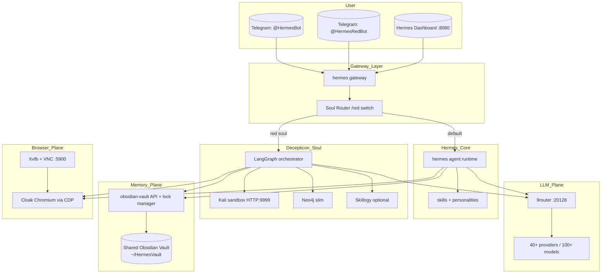

# Hermes Ultimate Agent — мастер-план

> **Этот план рассчитан на исполнение другой LLM шаг за шагом.**
> Не интерпретируй и не "улучшай" задачи. Делай ровно что написано, в порядке T-001 → T-NNN. После каждой задачи запускай её acceptance-check. После каждой фазы — gate-check фазы. Если check падает — **остановись и спроси юзера**, не переходи к следующей фазе.

---

## Зафиксированные архитектурные решения

- **Monorepo fork**. Всё мерджится в **один fork Hermes** — репозиторий `hermes-ultimate` на личном GitHub юзера. Никаких параллельных репов / стеков-оркестраторов рядом. Внутри fork'а — папка `stack/` с docker-compose файлами для вспомогательных сервисов (9router, vnc-cloak, decepticon-slim, vault-api). Hermes-Python живёт в корне как у апстрима.
- **Unlock — committed in-source**, не патч-файл. Изменения вкатываются прямо в `agent/prompt_builder.py`, `agent/subdirectory_hints.py`, `tools/cronjob_tools.py`, `cron/scheduler.py`, `tools/memory_tool.py` в нашем fork'е. Никаких `git apply` в install-time — наш репо уже unlocked.
- **Decepticon embed**: dual-mode. Внутри основного Hermes-бота — команда `/red` переключает SOUL/тулсет/роутинг на Decepticon-душу. Параллельно — отдельный `@HermesRedBot` для "чисто хакерских" сессий. Оба источника пишут в **один Obsidian-vault**.
- **LLM-роутинг**: единый 9router как unified gateway. LiteLLM из Decepticon-стека выпиливаем, Decepticon смотрит на `http://9router:20128/v1`. Hermes тоже идёт через 9router.
- **Decepticon strategy**: **slim+9router**. Постоянно работают только `LangGraph` + `Kali-sandbox` + `Neo4j(heap 128M)` + опционально `Skillogy`. Decepticon-web выпилен — его роль играет расширенный Hermes-дашборд.
- **Installer**: extends Hermes-овский `scripts/install.sh` (не пишем с нуля). Добавляет: проверку Docker, генерацию `.env` из template, `docker compose up -d`, post-install wizard для токенов. One-liner: `curl -fsSL https://raw.githubusercontent.com/<user>/hermes-ultimate/main/install.sh | bash`.
- **Target платформы**: Linux VPS (нативно через apt/systemd), WSL2 на Windows, macOS. Native Windows — не покрываем в этом цикле (Hermes-апстрим поддерживает, но наш стек завязан на Docker compose + Kali — упрощаем).

---

## Workflow исполнения (кто что делает)

```mermaid
flowchart LR
  U[You: human] -->|Шаг A| Fork[Fork hermes-agent-2026.6.5\nкак hermes-ultimate]
  Fork -->|Шаг B| LLM[Дать другой LLM этот план\n+ доступ к fork'у]
  LLM -->|Шаг C| Tasks[Применяет T-001..T-NNN\nкоммитит после каждой]
  Tasks -->|Шаг D| Push[git push на GitHub]
  Push -->|Шаг E| Server[VPS / WSL2 server\ncurl install.sh \| bash]
  Server -->|Шаг F| Live[Working stack]
```


**Шаг A** (юзер, разово, 10 мин): Клонируешь `D:\Stack\hermes-agent-2026.6.5` локально в новую папку или сразу пушишь на github как `https://github.com/<user>/hermes-ultimate`. Это твой fork. Сохраняешь upstream remote как `upstream` чтобы можно было pull'ить обновления.

**Шаг B** (юзер, 1 мин): Открываешь чат с другой LLM (например Codex/Claude/etc), даёшь ей:

- ссылку на этот план (`hermes_ultimate_agent_*.plan.md`)
- ссылку или checkout `hermes-ultimate` репозитория
- инструкцию: *"Выполни задачи T-001..T-NNN по порядку. После каждой задачи запусти её acceptance-check. После каждой фазы — gate-check фазы. Если что-то падает — остановись и опиши проблему. Коммить после каждой задачи с сообщением `T-NNN: <title>`."*

**Шаг C** (LLM, 8-12 часов работы): Тупо идёт по списку, создаёт/патчит файлы, коммитит, проверяет.

**Шаг D** (юзер, 1 мин): Просматриваешь PR / коммиты, мерджишь в main, `git push`.

**Шаг E** (юзер, на пустом VPS / в WSL2, 5-15 мин):

```bash
curl -fsSL https://raw.githubusercontent.com/<user>/hermes-ultimate/main/install.sh | bash
```

Installer:

1. Ставит системные deps (Docker, uv, Python 3.11, Node 22, ripgrep, ffmpeg)
2. Клонирует `hermes-ultimate` в `/opt/hermes-ultimate`
3. Устанавливает Hermes-Python через `uv pip install -e ".[all]"`
4. Генерирует `~/.hermes/stack/.env` из template (с auto-gen секретов)
5. Запускает `docker compose -f stack/docker-compose.yml up -d` (9router + vnc-cloak + vault-api + decepticon-slim)
6. Запускает `hermes setup --portal` (или wizard для своих токенов)
7. Спрашивает Telegram-токены (один или два бота)
8. Печатает финальные URL и инструкции

**Шаг F**: Открываешь дашборд на `:8080`, noVNC на `:6080`, пишешь боту в Telegram — всё работает.

---

## Целевой layout репозитория `hermes-ultimate`

```
hermes-ultimate/                    # fork hermes-agent-2026.6.5 + наши изменения
├── README.md                       # ПЕРЕПИСАН — про мегаагента, one-liner install
├── install.sh                      # ПЕРЕПИСАН — extends апстрим scripts/install.sh
├── install.ps1                     # ПЕРЕПИСАН — extends scripts/install.ps1
├── agent/
│   ├── prompt_builder.py           # ПАТЧ — unlock pkt 1 (in-source)
│   ├── subdirectory_hints.py       # ПАТЧ — unlock pkt 2
│   └── ...                         # остальное from upstream
├── cron/
│   └── scheduler.py                # ПАТЧ — unlock pkt 3b
├── tools/
│   ├── cronjob_tools.py            # ПАТЧ — unlock pkt 3a
│   ├── memory_tool.py              # ПАТЧ — unlock pkt 4
│   ├── cloak/                      # НОВЫЙ — CDP browser tools
│   │   ├── __init__.py
│   │   ├── navigate.py
│   │   ├── click.py
│   │   ├── fill.py
│   │   ├── screenshot.py
│   │   └── cookies.py
│   ├── reach/                      # НОВЫЙ — Agent-Reach wrapper
│   │   ├── __init__.py
│   │   └── reach_tool.py
│   ├── vault/                      # НОВЫЙ — vault tools (search/read/list/related)
│   │   ├── __init__.py
│   │   ├── search.py
│   │   ├── read.py
│   │   ├── list.py
│   │   └── related.py
│   └── ...                         # остальное from upstream
├── hermes_cli/
│   ├── soul_router.py              # НОВЫЙ
│   ├── backends/
│   │   ├── __init__.py             # НОВЫЙ
│   │   └── decepticon_backend.py   # НОВЫЙ
│   ├── gateway.py                  # ПАТЧ — soul-router integration
│   ├── telegram_managed_bot.py     # ПАТЧ — multi-bot
│   └── ...                         # остальное from upstream
├── gateway/platforms/
│   ├── telegram.py                 # ПАТЧ — multi-bot support
│   └── ...                         # остальное from upstream
├── web/                            # Hermes dashboard (Vite/React)
│   └── src/
│       ├── App.tsx                 # ПАТЧ — router add new pages
│       ├── plugins/registry.ts     # ПАТЧ — register new pages
│       └── pages/
│           ├── SoulsPage.tsx       # НОВЫЙ
│           ├── DecepticonPage.tsx  # НОВЫЙ
│           ├── VaultBrowserPage.tsx # НОВЫЙ (порт из hermes-link-curator)
│           ├── RouterPage.tsx      # НОВЫЙ (iframe → 9router)
│           ├── BrowserPage.tsx     # НОВЫЙ (noVNC live)
│           ├── BotsPage.tsx        # НОВЫЙ (multi-bot управление)
│           └── ...                 # остальные from upstream
├── skills/                         # bundled из hermes-skills-port + agent-reach
│   ├── note-taking/obsidian/       # from upstream Hermes
│   ├── red-teaming/                # from hermes-skills-port (16 skills)
│   ├── reverse-engineering/        # from hermes-skills-port (8 skills)
│   ├── forensics/                  # from hermes-skills-port (1 skill)
│   ├── osint/                      # from hermes-skills-port (2 skills)
│   ├── devops/                     # from hermes-skills-port (4 skills)
│   ├── research/                   # from hermes-skills-port (3 skills)
│   ├── software-development/       # from hermes-skills-port (7 skills, merge с upstream)
│   ├── registration-skills/        # from hermes-skills-port (4 skills)
│   └── agent-reach/                # from Agent-Reach-1.5.0/agent_reach/skill/
├── souls/                          # НОВАЯ ПАПКА — default soul YAMLs
│   ├── default.yaml
│   └── red.yaml
├── stack/                          # НОВАЯ ПАПКА — orchestration
│   ├── docker-compose.yml          # base: 9router, vnc-cloak, vault-api
│   ├── docker-compose.decepticon-slim.yml  # langgraph, kali-sandbox, neo4j, [skillogy]
│   ├── .env.template
│   ├── 9router/                    # (минимально — pull image, см. compose)
│   ├── vnc-cloak/
│   │   ├── Dockerfile
│   │   ├── supervisord.conf
│   │   └── chromium-launch.sh
│   ├── vault-api/
│   │   ├── Dockerfile
│   │   ├── main.py                 # FastAPI: locked append, read, search
│   │   └── requirements.txt
│   └── decepticon-slim/
│       ├── docker-compose.fragment.yml  # подключается через -f overlay
│       ├── middleware/
│       │   └── vault_sync.py       # Decepticon middleware
│       └── README.md               # ссылается на upstream Decepticon docs
├── scripts/
│   ├── install.sh                  # upstream — НЕ трогаем; наш install.sh в корне его вызывает
│   ├── install.ps1                 # тоже
│   ├── bootstrap-stack.sh          # НОВЫЙ — вызывается из корневого install.sh
│   ├── post-install-wizard.sh      # НОВЫЙ — токены, soul конфиги
│   └── smoke-tests/                # НОВАЯ ПАПКА — gate-check скрипты
│       ├── test_unlock_applied.py
│       ├── test_souls_switch.py
│       ├── test_vault_io.py
│       ├── test_cloak_cdp.py
│       └── test_decepticon_e2e.py
└── docs/
    ├── README-stack.md             # НОВЫЙ — описание stack/
    ├── README-souls.md             # НОВЫЙ — как делать свои души
    └── README-unlock.md            # НОВЫЙ — что и почему разблокировано
```

**Что не меняем в upstream Hermes:** `apps/desktop/`, `ui-tui/`, `acp_adapter/`, `acp_registry/`, `website/`, `optional-skills/`, `plugins/memory/`* (намеренно не подключаем), `providers/`, `tests/`. Остальное upstream-from-base — переезжает 1-в-1.

---

## Формат задачи (для исполняющей LLM)

Каждая задача T-NNN имеет:

- **id**: T-NNN
- **title**: что делаем одной строкой
- **type**: `create` | `patch` | `delete` | `bundle` (копирование из другой папки) | `verify`
- **target**: путь(и) к файлам в `hermes-ultimate`
- **action**: что конкретно сделать. Для `create` — содержимое или интерфейс. Для `patch` — точная локация и diff. Для `bundle` — source path и destination path.
- **acceptance**: команда + ожидаемый exit code / output, либо проверка "файл существует и содержит X"
- **commit**: точный текст commit-сообщения

После каждой фазы — **gate-check**: набор интеграционных проверок которые должны пройти. Если упало — STOP, опиши проблему юзеру, не лезь в следующую фазу.

---

---

## Целевая архитектура




Ключевые точки: один LLM-плэйн (9router), один memory-плэйн (Obsidian), один browser-плэйн (VNC+cloak), две "души" над общим Hermes-gateway.

---

## Фазы (8 шт.)

### Фаза 0. Init in-place + GitHub remote (юзер делает руками — без LLM)

Эта фаза — **не для LLM**, юзер делает сам в 5-10 минут. **Работаем in-place в `D:\Stack\hermes-agent-2026.6.5\`** — никаких копий в отдельные папки. Это и есть будущий `hermes-ultimate`.

- **T-000-A**: На GitHub создать пустой репо `hermes-ultimate` (private рекомендую). Скопировать SSH или HTTPS URL.
- **T-000-B**: Локально в PowerShell:
  ```powershell
  cd D:\Stack\hermes-agent-2026.6.5
  # Если папка уже git-репо upstream'а — снимем привязку к нему:
  if (Test-Path .git) { Remove-Item -Recurse -Force .git }
  git init
  git branch -M main
  git add .
  git commit -m "chore: import hermes-agent-2026.6.5 baseline"
  git remote add origin https://github.com/<user>/hermes-ultimate.git
  git remote add upstream https://github.com/NousResearch/hermes-agent.git  # опционально, для будущих pull'ов
  git push -u origin main
  mkdir .progress
  ```
- **T-000-C**: Запустить вторую сессию (другая LLM / Cursor / Codex) **в той же папке** `D:\Stack\hermes-agent-2026.6.5\`, дать ей промт (см. отдельный файл / чат-сообщение) который указывает на этот план.

После этой фазы папка `D:\Stack\hermes-agent-2026.6.5\` инициализирована как `hermes-ultimate` git-repo, привязана к юзеровскому GitHub, и в ней есть пустая `.progress\` для журнала.

### Фаза 1. Unified LLM-роутинг через 9router

**Цель**: один LLM-gateway для всего стека на `http://localhost:20128/v1`. Hermes и Decepticon оба ходят через 9router.

**Задачи:**

- **T-010** `create` `stack/.env.template` — все переменные стека одним файлом. Минимум: `NINEROUTER_JWT_SECRET=`, `NINEROUTER_INITIAL_PASSWORD=`, `NINEROUTER_API_KEY=`, `NEO4J_PASSWORD=`, `VNC_PASSWORD=`, `HERMES_VAULT_PATH=~/HermesVault`, `TELEGRAM_BOT_TOKEN=`, `TELEGRAM_RED_BOT_TOKEN=` (optional), `OPENAI_API_KEY=` (опц., fallback). Все секреты пустые — installer их генерирует. **Acceptance**: файл существует с >= 10 ключами.
- **T-011** `create` `stack/docker-compose.yml` — base compose с одним сервисом `9router`. Образ `decolua/9router:latest`, ports `20128:20128`, volume `9router_data:/data`, env через `.env`. Network `hermes-net` (`bridge`). `restart: unless-stopped`. **Acceptance**: `cd stack && docker compose config` → валидный YAML без ошибок.
- **T-012** `create` `stack/9router/README.md` — короткая шпаргалка (URL, default login, как добавить провайдера). **Acceptance**: файл существует.
- **T-013** `patch` Hermes конфиг через bootstrap-wizard (см. T-310 ниже). Hermes использует `~/.hermes/config.toml` — installer пишет туда `[providers.openai] base_url = "http://localhost:20128/v1"`, `api_key = "${NINEROUTER_API_KEY}"`. Это задача для wizard'а, а не на этапе фазы 1. Здесь только готовим **скелет конфига**: `create` `stack/templates/hermes-config.toml.j2` (jinja2-шаблон) с placeholder'ами `{{ ninerouter_api_key }}` и `{{ ninerouter_url }}`. **Acceptance**: файл существует.
- **T-014** `create` `scripts/smoke-tests/test_9router_alive.sh` — bash-скрипт: `curl -fsS http://localhost:20128/health || exit 1`. **Acceptance**: при поднятом 9router скрипт exit 0.

**Gate-check фазы 1:**

```bash
docker compose -f stack/docker-compose.yml up -d 9router
sleep 5
bash scripts/smoke-tests/test_9router_alive.sh
curl -sS http://localhost:20128/v1/models | grep -q "object"  # любой ответ от 9router API
```

### Фаза 1.5. Framework-unlock Hermes (полный, 4 точки, committed in-source)

Снимаем встроенные сканеры `tools/threat_patterns.py` в 4 местах. Изменения **коммитятся прямо в исходники нашего fork'а** — не как `.patch` файл. При upstream-апгрейде юзер делает `git merge upstream/main` и руками разрешает конфликты в этих 4 файлах. Подробный анализ — [d:\UNLOCK_DIFF.md](d:\UNLOCK_DIFF.md).

**Задачи:**

- **T-040** `patch` `agent/prompt_builder.py` — удалить import `scan_for_threats as _scan_for_threats`, удалить функцию `_scan_context_content()` целиком, в `load_soul_md`/`_load_hermes_md`/`_load_agents_md`/`_load_claude_md`/`_load_cursorrules` заменить `content = _scan_context_content(content, filename)` на `content = _truncate_content(content, filename)`. Если `import re` больше не нужен — удалить. **Acceptance**: `python -c "from agent.prompt_builder import _scan_context_content"` → `ImportError`.
- **T-041** `patch` `agent/subdirectory_hints.py` — удалить import `_scan_context_content` и его вызов. **Acceptance**: `grep _scan_context_content agent/subdirectory_hints.py` → пусто.
- **T-042** `patch` `tools/cronjob_tools.py` — удалить блок ~строки 40-228 (паттерн-словари + scanner функции + helper'ы). Убрать `scan_error = _scan_cron_prompt(...)` гарды в create/update. **Acceptance**: `grep _scan_cron_prompt tools/` → пусто, файл стал ~664 строк.
- **T-043** `patch` `cron/scheduler.py` — удалить функцию `_scan_assembled_cron_prompt()` и её вызов перед выполнением job. **Acceptance**: `grep _scan_assembled cron/scheduler.py` → пусто.
- **T-044** `patch` `tools/memory_tool.py` — `_sanitize_entries_for_snapshot()` → passthrough (`return list(entries)`). **НЕ трогать** `_scan_memory_content()`. **Acceptance**: `python -c "from tools.memory_tool import MemoryTool; assert 'Passthrough' in (MemoryTool._sanitize_entries_for_snapshot.__doc__ or '')"` → exit 0.
- **T-045** `create` `scripts/smoke-tests/test_unlock_applied.py` — pytest пишет временный SOUL с триггер-строкой `"command and control sliver beacon"`, грузит через `prompt_builder.load_soul_md`, ASSERT строка осталась (нет `[BLOCKED:`). **Acceptance**: `pytest scripts/smoke-tests/test_unlock_applied.py -v` → PASS.
- **T-046** `create` `docs/README-unlock.md` — документ что и почему разблокировано, ссылка на этот план. **Acceptance**: файл существует.

**Не трогаем (никаких задач):** `tools/approval.py`, `tools/skills_guard.py`, `tools/file_safety.py`, `tools/url_safety.py`, `tools/website_policy.py`, `agent/tool_guardrails.py`, `agent/message_sanitization.py`, `_scan_memory_content()`.

**Gate-check фазы 1.5:**

```bash
pytest scripts/smoke-tests/test_unlock_applied.py -v
grep -r "_scan_context_content\|_scan_cron_prompt\|_scan_assembled_cron_prompt" agent/ tools/ cron/ hermes_cli/  # пусто
python -c "from agent.prompt_builder import load_soul_md; print('OK')"  # OK без ImportError
```

### Фаза 2. Decepticon-as-soul — две точки входа

**Цель**: красная душа `/red` внутри основного бота + опциональный отдельный `@HermesRedBot`. Slim-Decepticon-стек (LangGraph + Kali-sandbox + Neo4j) поднимается рядом, Hermes говорит с ним через LangGraph SSE API.

#### 2a. Slim-форк Decepticon-стека

- **T-100** `bundle` копировать `D:\Stack\Decepticon-main\` в `stack/decepticon-slim/upstream/` (полная копия для reference, чтобы не качать апстрим в installer'е). **Acceptance**: `ls stack/decepticon-slim/upstream/decepticon/main.py` существует.
- **T-101** `create` `stack/docker-compose.decepticon-slim.yml` — compose-overlay. Сервисы: `langgraph` (Python image, build из `stack/decepticon-slim/upstream/`, command `langgraph dev --host 0.0.0.0 --port 2024`, env `DECEPTICON_LLM__PROXY_URL=http://9router:20128/v1`, depends_on `9router`, `neo4j`), `sandbox` (Kali image `kalilinux/kali-rolling` + apt-install `nmap sqlmap metasploit-framework hydra` через Dockerfile, volume `~/HermesVault/Engagements:/engagements:rw`, network_mode `bridge` с `hermes-net`), `neo4j` (image `neo4j:5.20`, env `NEO4J_AUTH=neo4j/${NEO4J_PASSWORD}`, `NEO4J_server_memory_heap_max__size=128M`, volume `neo4j_data:/data`, ports `7474:7474` `7687:7687`). **БЕЗ** `litellm`, `postgres`, `decepticon-web`. Network `hermes-net` (external: true, создаётся base compose'ом). **Acceptance**: `docker compose -f stack/docker-compose.yml -f stack/docker-compose.decepticon-slim.yml config` → валидный YAML.
- **T-102** `create` `stack/decepticon-slim/Dockerfile.sandbox` — `FROM kalilinux/kali-rolling`, `RUN apt-get update && apt-get install -y nmap sqlmap metasploit-framework hydra hashcat netcat-traditional curl python3-pip`, `WORKDIR /workspace`, `CMD ["/bin/bash"]`. **Acceptance**: `docker build -f stack/decepticon-slim/Dockerfile.sandbox stack/decepticon-slim/` собирается.
- **T-103** `create` `stack/decepticon-slim/.env.fragment` — env для slim-стека: `LANGGRAPH_API_URL=http://localhost:2024`, `NEO4J_URI=bolt://localhost:7687`. **Acceptance**: файл существует.

#### 2b. Soul Router в Hermes

- **T-110** `create` `souls/default.yaml` — `name: default`, `backend: hermes`, `soul_md: souls/default/SOUL.md` (создать в T-112), `allowed_toolsets: [all]`, `vault_load: {include: ["INDEX.md", "Wiki/Hot/general/**", "Wiki/Hot/personal/**"], budget_kb: 5}`. **Acceptance**: yaml валиден (`python -c "import yaml; yaml.safe_load(open('souls/default.yaml'))"`).
- **T-111** `create` `souls/red.yaml` — `name: red`, `backend: decepticon`, `soul_md: souls/red/SOUL.md`, `allowed_toolsets: [cloak, reach, shell, vault, kali]`, `langgraph_url: http://localhost:2024`, `vault_load: {include: ["INDEX.md", "Engagements/${current_slug}/**", "Wiki/Findings/*.md"], budget_kb: 8}`. **Acceptance**: yaml валиден.
- **T-112** `create` `souls/default/SOUL.md` + `souls/red/SOUL.md` — дефолтные SOUL.md тексты (для default — generic helpful assistant; для red — Decepticon-RoE-aware operator). **Acceptance**: оба файла существуют, > 200 байт каждый.
- **T-113** `create` `hermes_cli/soul_router.py` — модуль с классом `SoulRouter`: методы `get_active_soul(chat_id) -> SoulConfig`, `set_active_soul(chat_id, name)`, `list_souls()`. State в SQLite `~/.hermes/soul_state.db` (таблица `chat_soul (chat_id PK, soul_name, updated_at)`). Soul-конфиги читаются из `souls/*.yaml` (lazy, с file-mtime cache). Класс `SoulConfig` (dataclass) парсит yaml в типизированные поля. **Acceptance**: `python -c "from hermes_cli.soul_router import SoulRouter; r=SoulRouter(); print(r.list_souls())"` печатает `['default', 'red']`.
- **T-114** `patch` `hermes_cli/gateway.py` — добавить hook перед передачей в agent loop: если message.text стартует с `/red`, `/blue`, `/soul <name>` — вызвать `soul_router.set_active_soul(chat_id, ...)` и ответить confirmation. Иначе — продолжить, но передать `soul_config = soul_router.get_active_soul(chat_id)` в agent context. **Acceptance**: интеграционный тест T-118 проходит.
- **T-115** `patch` `agent/prompt_builder.py` — функция `load_soul_md` теперь принимает опциональный `soul_path` override (если передан — грузит из него, иначе дефолтное поведение). Используется soul_router'ом. **Acceptance**: existing tests не падают (`pytest tests/test_prompt_builder.py -v`), новый тест в T-118 проходит.
- **T-116** `create` `docs/README-souls.md` — как делать свои души, формат yaml, как добавить SOUL.md. **Acceptance**: файл существует.
- **T-117** `patch` `agent/prompt_builder.py` — реализовать `vault_load` логику: при сборке system-prompt, если `soul_config.vault_load` задан, загрузить файлы по `include` glob'ам (с применением `exclude`), обрезать каждый до `snippet_chars`, суммарно не превышать `budget_kb`. Если превышено — оставить только `INDEX.md` + notice "use vault.search/vault.read". **Acceptance**: тест T-118 включает проверку что для red-soul vault_load возвращает корректный набор путей.
- **T-118** `create` `scripts/smoke-tests/test_souls_switch.py` — pytest: создаёт `SoulRouter`, проверяет default-soul загружается, переключает на red через `set_active_soul`, проверяет что `get_active_soul` возвращает red. **Acceptance**: `pytest scripts/smoke-tests/test_souls_switch.py -v` PASS.

#### 2c. Decepticon backend adapter

- **T-120** `create` `hermes_cli/backends/__init__.py` — пустой файл-маркер пакета. **Acceptance**: файл существует.
- **T-121** `create` `hermes_cli/backends/base.py` — абстрактный `AgentBackend` с методами `async def stream(messages, tools, system_prompt) -> AsyncIterator[StreamEvent]`. **Acceptance**: импорт `from hermes_cli.backends.base import AgentBackend` работает.
- **T-122** `create` `hermes_cli/backends/decepticon_backend.py` — `class DecepticonBackend(AgentBackend)`. В `stream()`: POST на `http://localhost:2024/runs/stream` с `{input: {messages: [...]}}`, парсит SSE `data: {...}` события, маппит LangGraph события на Hermes `StreamEvent` (token, tool_call, tool_result, hitl_request). HITL-request → конвертит в Hermes `command-approval-request` (см. `tools/approval.py`), ждёт answer, отправляет обратно в LangGraph через `/runs/<run_id>/resume`. **Acceptance**: unit-тест с моком HTTP (T-125) проходит.
- **T-123** `patch` `hermes_cli/gateway.py` — после получения `soul_config`, выбирать backend: если `soul_config.backend == "decepticon"` — использовать `DecepticonBackend`, иначе нативный hermes loop. **Acceptance**: интеграционный тест T-129 (Phase 2 gate-check) проходит.
- **T-124** `create` `stack/decepticon-slim/middleware/vault_sync.py` — Decepticon-middleware: после каждого `kg_add_node`/`kg_add_edge` дёргает `POST http://vault-api:8090/append` с markdown'ом findings в `Wiki/Findings/<host>.md`. Регистрируется в Decepticon graph как `before_node_call` middleware. **Acceptance**: импорт работает (полный e2e — в T-129).
- **T-125** `create` `scripts/smoke-tests/test_decepticon_backend_mock.py` — pytest с моком SSE-сервера, проверяет что `DecepticonBackend.stream()` корректно парсит fake events. **Acceptance**: PASS.

#### 2d. Второй Telegram-бот (опционально)

- **T-130** `patch` `gateway/platforms/telegram.py` — заменить single-bot инициализацию на `dict[bot_token, Bot]`. Конфиг читается из `~/.hermes/gateway.yaml` секции `telegrams:` (список ботов с `token`, `default_soul`, `allowed_users`). Запуск polling через `asyncio.gather(*[bot.start_polling() for bot in bots])`. **Acceptance**: gateway стартует с 1 ботом (как сейчас) — backward-compat. Грейсфул-режим: если в yaml только один — работает по-старому.
- **T-131** `patch` `hermes_cli/telegram_managed_bot.py` — поддержка `--bot-id <id>` флага, чтобы команда `hermes telegram-managed-bot send` могла адресовать конкретного бота. **Acceptance**: `hermes telegram-managed-bot --help` показывает `--bot-id`.
- **T-132** `create` `~/.hermes/gateway.yaml.template` (хранится в `stack/templates/gateway.yaml.j2`) — пример с двумя ботами. Wizard инсталлятора генерирует реальный `~/.hermes/gateway.yaml` из этого шаблона если юзер передал `--with-second-bot`. **Acceptance**: файл существует.
- **T-133** Юзер-фасинг: документация в `docs/README-souls.md` (расширение T-116) — как @HermesRedBot настроить с `default_soul: red`. **Acceptance**: раздел есть в файле.

**Gate-check фазы 2:**

```bash
pytest scripts/smoke-tests/test_souls_switch.py -v
pytest scripts/smoke-tests/test_decepticon_backend_mock.py -v
docker compose -f stack/docker-compose.yml -f stack/docker-compose.decepticon-slim.yml up -d
sleep 30  # langgraph и neo4j долго стартуют
curl -fsS http://localhost:2024/health  # LangGraph живой
curl -fsS http://localhost:7474  # Neo4j browser живой
# Manual: запустить hermes gateway, написать "/red" в чат, проверить что бот ответил подтверждением переключения души
```

### Фаза 3. Общий Obsidian-vault (shared brain)

**Принцип**: один источник правды — markdown-vault `~/HermesVault/`. Никаких memory-плагинов. Glassbox > black box. Vault shared между Hermes (нативно) и vault-api (контейнер mount'ит ту же папку).

**Дизайн-паттерны** (только как идеи, не копируем контент): tiered memory из `awesome-second-brain-main/solutions/mnemosyne.md`, pages+graph+timeline из `gbrain.md`, activation-evidence из `capabilities/activation-evidence.md`, compile/query/lint из `hermes-llm-wiki.md`.

**Задачи:**

- **T-200** `create` `stack/vault-api/Dockerfile` — `FROM python:3.11-slim`, copy `requirements.txt` + `main.py`, `CMD ["uvicorn", "main:app", "--host", "0.0.0.0", "--port", "8090"]`. **Acceptance**: `docker build stack/vault-api/` собирается.
- **T-201** `create` `stack/vault-api/requirements.txt` — `fastapi`, `uvicorn`, `filelock`, `pydantic`. **Acceptance**: файл существует.
- **T-202** `create` `stack/vault-api/main.py` — FastAPI endpoints: `POST /append {path, content}` (атомарный append с `filelock` на файл), `GET /read?path=` (читает файл), `POST /search {query, top_k}` (FTS5 поиск через sqlite), `GET /list?folder=&glob=`, `GET /related?path=` (backlinks по wikilinks). Vault root из env `HERMES_VAULT_PATH`. **Acceptance**: `python -c "from stack.vault_api.main import app; print(app.routes)"` показывает >= 5 routes.
- **T-203** `patch` `stack/docker-compose.yml` — добавить сервис `vault-api`: build `stack/vault-api/`, ports `8090:8090`, volume `${HERMES_VAULT_PATH}:/vault:rw`, env `HERMES_VAULT_PATH=/vault`, `restart: unless-stopped`. **Acceptance**: `docker compose config` валиден.
- **T-204** `create` `tools/vault/__init__.py` + `search.py`, `read.py`, `list.py`, `related.py`, `append.py` — Hermes-тулы, каждый = тонкая HTTP-обёртка над `http://localhost:8090/<endpoint>`. Регистрируются через стандартный Hermes toolset mechanism (см. `tools/__init__.py`). Имена: `vault.search`, `vault.read`, `vault.list`, `vault.related`, `vault.append`. **Acceptance**: `hermes tools list | grep ^vault\.` показывает 5 тулов.
- **T-205** `create` `scripts/init-vault.sh` — bash-скрипт создающий структуру нового vault'а: `mkdir -p $HERMES_VAULT_PATH/Wiki/{Hot,Warm,Cold,Findings,References/SecondBrain}`, `mkdir -p $HERMES_VAULT_PATH/Engagements`, `mkdir -p $HERMES_VAULT_PATH/Sessions`, `mkdir -p $HERMES_VAULT_PATH/.meta`, создаёт пустые `INDEX.md`, `.meta/access.log`, `.meta/health.json`. **Acceptance**: после запуска `tree -L 3 $HERMES_VAULT_PATH` показывает все папки.
- **T-206** `patch` `skills/note-taking/obsidian/SKILL.md` — заменить пути на структуру с Hot/Warm/Cold + добавить инструкцию использовать `vault.append` вместо прямой записи в файл (для атомарности и записи в `.meta/access.log`). **Acceptance**: skill содержит подстроки `Wiki/Hot`, `vault.append`, `Engagements/`.
- **T-207** `create` `scripts/vault-tier-rotate.py` — Python-скрипт: парсит `.meta/access.log`, для каждой страницы считает последний read, перемещает Hot→Warm (no read 7d) и Warm→Cold (no read 90d). Обновляет wikilinks в других страницах (переписывает пути). **Acceptance**: `python scripts/vault-tier-rotate.py --dry-run` печатает план без падений.
- **T-208** `create` `scripts/vault-consolidate.py` — заглушка: TODO для агентного skill `vault-consolidator` (фаза 3 финализируется позже). Сейчас просто печатает "TODO". **Acceptance**: скрипт запускается, exit 0.
- **T-209** `create` `scripts/vault-rebuild-index.py` — собирает `INDEX.md` из всех `.md` файлов: для каждой страницы вытягивает H1 заголовок + frontmatter `tags:` + первые 80 символов first paragraph. Группирует по тиру (Hot/Warm/Cold/Findings/Engagements). Пишет в `$HERMES_VAULT_PATH/INDEX.md`. Инкрементально по mtime (сохраняет hash в `.meta/index_cache.json`). **Acceptance**: после первого запуска `INDEX.md` существует и содержит заголовки всех тестовых страниц.
- **T-210** `create` `cron/jobs/vault-maintenance.yaml` — Hermes-cron-job definitions: `vault-tier-rotate` (`0 3 * `* *), `vault-consolidate` (`0 4 * * 0`), `vault-prune` (`0 5 1 * `*), `vault-rebuild-index` (`*/15 * * * *`). Каждый job вызывает соответствующий скрипт из `scripts/`. **Acceptance**: `hermes cron list` показывает все 4 джоба после `hermes cron load cron/jobs/vault-maintenance.yaml`.
- **T-211** `create` `scripts/smoke-tests/test_vault_io.py` — pytest: запускает `vault-api` локально через `uvicorn` в subprocess, делает append/read/search, проверяет файлы созданы корректно, FTS5 находит свежесозданную страницу. **Acceptance**: PASS.
- **T-212** Vault sync из Decepticon middleware (`stack/decepticon-slim/middleware/vault_sync.py`, создан в T-124) теперь использует `http://vault-api:8090/append`. **Acceptance**: уже покрыто T-124 + integration-test T-129.

**Gate-check фазы 3:**

```bash
bash scripts/init-vault.sh
docker compose up -d vault-api
sleep 3
pytest scripts/smoke-tests/test_vault_io.py -v
python scripts/vault-rebuild-index.py
test -f ~/HermesVault/INDEX.md
hermes tools list | grep -c ^vault\.  # >= 5
```

**Дизайн-паттерны взяты из [awesome-second-brain-main/](awesome-second-brain-main/)** (как идеи, не как код):

- Из [solutions/gbrain.md](awesome-second-brain-main/solutions/gbrain.md) — pages + graph + timeline + maintenance jobs. У нас: pages = `Wiki/*.md`, graph = backlinks между записями (поддерживается Obsidian-style `[[wikilinks]]`), timeline = `Sessions/YYYY-MM-DD/`, maintenance = cron-job (см. ниже).
- Из [solutions/mnemosyne.md](awesome-second-brain-main/solutions/mnemosyne.md) — тиры памяти + консолидация. У нас: 3 тира файлов в Wiki — `Hot/` (последние 7 дней, всегда в контексте), `Warm/` (последние 90 дней, по запросу), `Cold/` (всё остальное, только по explicit search).
- Из [capabilities/activation-evidence.md](awesome-second-brain-main/capabilities/activation-evidence.md) — критерий "was this memory actually loaded/cited/used". У нас: каждый vault-read логируется в `~/HermesVault/.meta/access.log`, дашборд показывает hit-rate, мёртвые страницы (zero reads за 30 дней) предлагаются к архивации.
- Из [solutions/hermes-llm-wiki.md](awesome-second-brain-main/solutions/hermes-llm-wiki.md) — паттерн compile/query/lint Wiki которым агент сам управляет (валидирует ссылки, фиксит дубликаты).

**Один путь** на хосте: `~/HermesVault/` (на VPS — `/var/lib/hermes-vault/`). Bind-mounted в Hermes, в Decepticon's LangGraph, в Skillogy.

- Адаптируем существующий [hermes-agent-2026.6.5/skills/note-taking/obsidian/SKILL.md](hermes-agent-2026.6.5/skills/note-taking/obsidian/SKILL.md) как канонический writer.
- **Vault-структура**:
  - `Wiki/Hot/`, `Wiki/Warm/`, `Wiki/Cold/` — three-tier long-term knowledge (доступно обеим душам на чтение/запись). Промоушн между тирами — раз в сутки крон-job (`vault-tier-rotate`) на основании `access.log` (как `mnemosyne`-pattern).
  - `Wiki/References/SecondBrain/` — пустая папка-плейсхолдер. (По решению: материал из `awesome-second-brain-main` НЕ копируем как Wiki-pages, используем только как design-inspiration. Если потом захочешь — кинешь руками.)
  - `Engagements/<slug>/` — Decepticon-only writes (RoE, ConOps, OPPLAN, findings)
  - `Sessions/YYYY-MM-DD/<chat_id>.md` — Hermes auto-log сессий (через cron skill)
  - `.meta/access.log` — JSONL: timestamp, path, reader_soul, query, was_cited. Источник для vault-health метрик.
  - `.meta/health.json` — sycchronized snapshot: hit-rate, dead pages, duplicates, broken links.
  - `INDEX.md` — корневой индекс, поддерживается `link-curator-dashboard` (берём из [hermes-link-curator-main/README.md](hermes-link-curator-main/README.md))
- **Lock manager** — мини-FastAPI сервис `obsidian-vault-api` (порт 8090): атомарные append-only записи + file-locks, чтобы две души не корраптили один файл при одновременной записи. Используется как MCP-server.
- **Стратегия загрузки vault'а в новую сессию** (критично, иначе агент захлебнётся):
  - Автоматом в system-prompt уходит **только скелет**: `INDEX.md` (заголовки+теги+1-строчные summary, ~1-2 KB) + `Wiki/Hot/` (первые 200 симв. каждой страницы за последние 7 дней). **Hard budget 5 KB / ~1500 токенов**. Если превышено — режется до INDEX + notice "use vault.search".
  - Контент достаётся **только по explicit tool call'у**:
    - `vault.search(query)` — FTS5-поиск, топ-5 сниппетов + paths (расширение существующего Hermes `FTS5 session search`).
    - `vault.read(path)` — конкретный файл (warning при > 10 KB).
    - `vault.list(folder, glob)` — листинг.
    - `vault.related(path)` — backlinks по wikilink-парсингу.
  - `Wiki/Warm/`, `Wiki/Cold/`, `Engagements/`*, `Sessions/`* — **никогда автоматом**, только через search/read.
  - **Per-soul конфиг загрузки** в `~/.hermes/souls/<name>.yaml`:
    ```yaml
    vault_load:
      include: [INDEX.md, "Wiki/Hot/personal/**", "Wiki/Hot/general/**"]
      exclude: ["Engagements/**"]
      budget_kb: 5
      snippet_chars: 200
    ```
    - Default-soul: грузит personal+general Hot
    - Red-soul: грузит INDEX + `Engagements/<current_slug>/` + последние 3 `Wiki/Findings/*.md`. Личные заметки не тянет.
- **Maintenance crons** (Hermes cron система, defined in `~/.hermes/cron.yaml`):
  - `vault-tier-rotate` (раз в сутки): по `.meta/access.log` промоушн страниц Hot→Warm (не читались 7d), Warm→Cold (90d).
  - `vault-consolidate` (раз в неделю): FTS5 similarity-search находит близкие дубликаты, агент-driven merge через специальный skill `vault-consolidator`.
  - `vault-prune` (раз в месяц): мёртвые страницы Cold (zero reads 6m) → notification в дашборд "архивировать?", без авто-удаления.
  - `vault-rebuild-index` (раз в час): пересобирает `INDEX.md` из всего vault'а (быстро, инкрементально по mtime).
- **Конвертер findings**: новый Decepticon-middleware который после каждого `kg_add_node`/`kg_add_edge` в Neo4j параллельно дёргает vault API и пишет markdown-страничку в `Wiki/Findings/<host>.md`. Так Neo4j-граф остаётся внутри Decepticon, а human-readable резюме доступно через Hermes.
- Дашборд из [hermes-link-curator-main/dashboard/](hermes-link-curator-main/) портируем в Hermes web как страницу "Vault Browser" (вместо отдельного порта 8090).

### Фаза 4. Дашборд — расширенная версия

**Цель**: 7 новых страниц/расширений к Hermes-web (`web/`, Vite+React). Backend — расширения `/api/`* Hermes-backend.

**Задачи (frontend):**

- **T-400** `patch` `web/src/App.tsx` (или `routes.tsx`) — добавить routes для `/souls`, `/decepticon`, `/vault`, `/router`, `/browser`, `/bots`, `/system`. **Acceptance**: `npm run build` собирается без ошибок.
- **T-401** `patch` `web/src/plugins/registry.ts` — зарегистрировать новые pages в навигации (sidebar / topbar). **Acceptance**: при `npm run dev` все 7 пунктов видны в меню.
- **T-402** `create` `web/src/pages/SoulsPage.tsx` — таблица душ из `GET /api/souls`, активная per chat_id, YAML-редактор (Monaco), кнопка "save" → `PUT /api/souls/<name>`, hot-reload через WS `/api/ws/souls`. **Acceptance**: страница рендерится без runtime-ошибок, список душ грузится.
- **T-403** `create` `web/src/pages/DecepticonPage.tsx` — статус контейнеров (langgraph/sandbox/neo4j) через `GET /api/stack/status`, кнопки "start ops" (ad/c2-sliver/reversing) через `POST /api/decepticon/ops`, list of engagements (читает `~/HermesVault/Engagements/`), iframe Neo4j browser `http://localhost:7474`. **Acceptance**: страница рендерится.
- **T-404** `bundle` копировать `D:\Stack\hermes-link-curator-main\dashboard\src\` → `web/src/pages/VaultBrowser/` (всю папку). **Acceptance**: файлы скопированы.
- **T-405** `create` `web/src/pages/VaultBrowserPage.tsx` — обёртка над импортированным VaultBrowser-компонентом + добавить таб "Engagements" (читает `Engagements/`*) + таб "Health" (читает `.meta/health.json` через `GET /api/vault/health`, рендерит hit-rate, dead pages, duplicates с кнопками "promote/archive"). **Acceptance**: рендерится.
- **T-406** `create` `web/src/pages/RouterPage.tsx` — `<iframe src="http://localhost:20128">` + side-panel со списком моделей через `GET http://localhost:20128/v1/models`. **Acceptance**: iframe грузит 9router UI.
- **T-407** `create` `web/src/pages/BrowserPage.tsx` — noVNC `<iframe src="http://localhost:6080/vnc.html?autoconnect=true&password=${VNC_PASSWORD}">` (read-only mode default), кнопки "Take control"/"Release", profile-selector (dropdown из `GET /api/cloak/profiles`), "Import cookies" upload-form. **Acceptance**: рендерится, noVNC iframe загружает интерфейс.
- **T-408** `create` `web/src/components/ActivitySidebarIndicator.tsx` — точка-индикатор в sidebar, подписывается на WS `/api/ws/cloak-activity`, меняет цвет (grey/yellow/red). Клик → `navigate('/browser')`. Включается в основной layout. **Acceptance**: компонент рендерится в layout.
- **T-409** `patch` `web/src/pages/ChannelsPage.tsx` (расширение существующей страницы) — добавить секцию "Telegram bots": список из `GET /api/gateway/bots`, для каждого — default_soul (dropdown), allowed_users (chips), token (masked). **Acceptance**: рендерится с >=1 ботом.
- **T-410** `create` `web/src/pages/BotsPage.tsx` — отдельная страница для управления ботами (расширение T-409, если ChannelsPage переполнена). **Acceptance**: рендерится.
- **T-411** `patch` `web/src/pages/EnvPage.tsx` (или создать `SystemPage.tsx`) — добавить секцию "Docker Stack": список сервисов из `GET /api/stack/services` со статусами, кнопки start/stop/restart/logs. **Acceptance**: рендерится.

**Задачи (backend):**

- **T-420** `create` `hermes_cli/web_api/souls.py` — FastAPI router: `GET /api/souls`, `GET /api/souls/{name}`, `PUT /api/souls/{name}`, WS `/api/ws/souls`. Backed by `SoulRouter` из T-113. **Acceptance**: `curl localhost:8080/api/souls` возвращает JSON.
- **T-421** `create` `hermes_cli/web_api/stack.py` — FastAPI router: `GET /api/stack/services` (через `docker compose ps --format json`), `POST /api/stack/{service}/{action}` (start/stop/restart, action whitelisted), `GET /api/stack/{service}/logs?tail=200`. Запускает docker через subprocess (не unix socket — проще). **Acceptance**: `curl localhost:8080/api/stack/services` возвращает массив.
- **T-422** `create` `hermes_cli/web_api/decepticon.py` — `GET /api/decepticon/engagements`, `POST /api/decepticon/ops {kind}` → дёргает LangGraph через `decepticon_backend.start_ops(kind)`. **Acceptance**: рендерится в Postman 200.
- **T-423** `create` `hermes_cli/web_api/vault.py` — `GET /api/vault/health` (читает `.meta/health.json`), `GET /api/vault/tree?folder=`, `POST /api/vault/promote {path, tier}` → переименовывает файл между Hot/Warm/Cold папками + обновляет wikilinks. **Acceptance**: endpoints работают, smoke test PASS.
- **T-424** `create` `hermes_cli/web_api/cloak.py` — `GET /api/cloak/profiles`, `POST /api/cloak/profile/active {name}` (graceful-restart Chromium с новым `--user-data-dir`), `POST /api/cloak/cookies/import` (multipart upload + write в выбранный профиль). WS `/api/ws/cloak-activity` (subscribe на CDP events, emit `idle/active/stale/error`). **Acceptance**: endpoints работают.
- **T-425** `create` `hermes_cli/web_api/gateway.py` — `GET /api/gateway/bots`, `PUT /api/gateway/bots/{id}` (изменение default_soul/allowed_users), читает/пишет `~/.hermes/gateway.yaml`. **Acceptance**: endpoints работают.
- **T-426** `patch` `hermes_cli/web_api/__init__.py` (или main app.py) — зарегистрировать все 6 новых routers. **Acceptance**: `curl localhost:8080/openapi.json | jq '.paths | keys'` показывает все новые пути.

**Gate-check фазы 4:**

```bash
cd web && npm run build  # без ошибок
hermes web start &  # backend
curl -sS localhost:8080/api/souls | jq .
curl -sS localhost:8080/api/stack/services | jq .
curl -sS localhost:8080/api/vault/health | jq .
# Manual: открыть http://localhost:8080, проверить все 7 страниц рендерятся
```

### Фаза 5. VNC + Cloak browser (always-on, live-наблюдение)

**Цель**: 24/7 контейнер с Xvfb+x11vnc+noVNC+Chromium-cloak. Persistent Chromium, profile-switching через graceful-restart. Hermes-тулы CDP + dashboard live-view.

**Задачи (контейнер):**

- **T-500** `create` `stack/vnc-cloak/Dockerfile` — `FROM debian:12-slim`, install `xvfb x11vnc supervisor openbox novnc websockify chromium ffmpeg curl`, копировать `supervisord.conf` и `chromium-launch.sh`. EXPOSE 5900, 6080, 9222. **Acceptance**: `docker build stack/vnc-cloak/` собирается, образ ~600-800MB.
- **T-501** `create` `stack/vnc-cloak/supervisord.conf` — три программы: `xvfb` (`Xvfb :99 -screen 0 1920x1080x24`), `openbox` (`openbox --display=:99`), `x11vnc` (`x11vnc -display :99 -forever -shared -nopw` — пароль ставится через env при start, передаётся через `-passwdfile`), `novnc` (`websockify --web=/usr/share/novnc 6080 localhost:5900`), `chromium` (запускается `chromium-launch.sh`). **Acceptance**: при `docker run` все 5 процессов стартуют, в логах нет panic'ов.
- **T-502** `create` `stack/vnc-cloak/chromium-launch.sh` — bash: ждёт когда `:99` поднимется (`xdpyinfo -display :99`), затем `exec chromium --no-sandbox --remote-debugging-port=9222 --remote-debugging-address=0.0.0.0 --user-data-dir=/profiles/${CLOAK_PROFILE:-default} --window-size=1920,1080 --start-maximized` (плюс cloak-флаги: `--disable-blink-features=AutomationControlled`, `--disable-features=IsolateOrigins,site-per-process` и т.д. — взять из [hermes-skills-port/registration-skills/cloakbrowser-cdp-session/SKILL.md](hermes-skills-port/registration-skills/cloakbrowser-cdp-session/SKILL.md)). **Acceptance**: внутри контейнера `curl http://localhost:9222/json/version` возвращает Chromium-метаданные.
- **T-503** `patch` `stack/docker-compose.yml` — добавить сервис `vnc-cloak`: build `stack/vnc-cloak/`, ports `5900:5900`, `6080:6080`, `9222:9222`, volumes `~/.hermes/browser-profiles:/profiles:rw`, env `VNC_PASSWORD`, `CLOAK_PROFILE=default`, `restart: unless-stopped`. **Acceptance**: `docker compose config` валиден.

**Задачи (Hermes-тулы):**

- **T-510** `create` `tools/cloak/__init__.py` + общий хелпер `_cdp_client.py` (создаёт `pychromedevtools` или `playwright.chromium.connect_over_cdp("ws://localhost:9222")` connection). **Acceptance**: импорт работает.
- **T-511** `create` `tools/cloak/navigate.py` — `async def cloak_navigate(url: str, timeout: int = 30) -> dict`. **Acceptance**: hermes registry показывает tool.
- **T-512** `create` `tools/cloak/click.py` — `async def cloak_click(selector: str) -> dict`. **Acceptance**: tool в registry.
- **T-513** `create` `tools/cloak/fill.py` — `async def cloak_fill(selector: str, text: str) -> dict`. **Acceptance**: tool в registry.
- **T-514** `create` `tools/cloak/screenshot.py` — `async def cloak_screenshot() -> dict` (возвращает base64 PNG + сохраняет в `~/HermesVault/Sessions/screenshots/<ts>.png`). **Acceptance**: tool в registry.
- **T-515** `create` `tools/cloak/cookies.py` — `cloak_cookies_export(domain: str | None)`, `cloak_cookies_import(json_path)`. **Acceptance**: tools в registry.
- **T-516** `patch` `tools/__init__.py` (или toolset registry) — добавить `cloak.`* в default toolset. **Acceptance**: `hermes tools list | grep ^cloak\.` показывает >= 5 тулов.
- **T-517** `create` `scripts/smoke-tests/test_cloak_cdp.py` — pytest: подключается к `http://localhost:9222/json/version`, вызывает `cloak_navigate("about:blank")`, `cloak_screenshot()`, проверяет файл создан. **Acceptance**: PASS (требует поднятый vnc-cloak контейнер).

**Задачи (recorder + notify, опционально, можно отложить):**

- **T-520** `create` `scripts/cloak-recorder.py` — слушает CDP `Page.frameStartedLoading`/`Network.requestWillBeSent`; при активности > 5s — запускает `ffmpeg -f x11grab -i :99 ...` в `~/HermesVault/Sessions/recordings/<ts>.webm`. Останавливает при idle > 30s. Запускается как cron/systemd. **Acceptance**: при искусственной активности файл .webm появляется.
- **T-521** `create` `scripts/cloak-notify.py` — CDP-listener на `Page.javascriptDialogOpening`, навигации на новые домены, login-form fill. При триггере шлёт Telegram через Hermes-API `POST /api/telegram/notify`. **Acceptance**: ручной тест — открыть `javascript:alert('x')` через cloak.navigate → пришло сообщение в Telegram.

**Gate-check фазы 5:**

```bash
docker compose up -d vnc-cloak
sleep 10
curl -fsS http://localhost:9222/json/version  # Chromium alive
curl -fsS http://localhost:6080/vnc.html  # noVNC web alive
pytest scripts/smoke-tests/test_cloak_cdp.py -v  # PASS
# Manual: открыть http://localhost:6080 в браузере, ввести VNC пароль, увидеть Chromium-окно
```

### Фаза 6. Agent-Reach как capability layer

**Цель**: установить Agent-Reach, зарегистрировать его skill, подружить с cloak-browser-cookies.

**Задачи:**

- **T-600** `patch` `pyproject.toml` (или Hermes `requirements.txt` если нет pyproject) — добавить `agent-reach` в dependencies. **Acceptance**: `uv pip install -e ".[all]"` ставит agent-reach.
- **T-601** `bundle` копировать `D:\Stack\Agent-Reach-1.5.0\agent_reach\skill\` → `skills/agent-reach/`. **Acceptance**: `ls skills/agent-reach/SKILL_en.md` существует.
- **T-602** `create` `tools/reach/__init__.py` + `tools/reach/reach_tool.py` — Hermes-тул `reach(channel: str, action: str, **kwargs) -> dict`. Под капотом вызывает CLI `agent-reach <channel> <action>` через subprocess. Параллельно поддерживает `--mcp` режим — спавнит [Agent-Reach MCP server](Agent-Reach-1.5.0/agent_reach/integrations/mcp_server.py) и общается через stdio. **Acceptance**: `hermes tools list | grep ^reach` показывает тул.
- **T-603** `create` `scripts/init-agent-reach.sh` — `agent-reach init`, `agent-reach doctor`, в конце пишет статус каналов в `~/.hermes/reach-status.json`. **Acceptance**: после запуска файл существует с >=5 каналами.
- **T-604** `create` `scripts/cloak-cookie-bridge.py` — экспортирует cookies из cloak-профиля в формат `agent-reach` для каналов (twitter/reddit/etc). Записывает в директорию которую читает agent-reach (`~/.config/agent-reach/cookies/`). Запускается при смене активного cloak-профиля (вызов из `cloak.profile_set`). **Acceptance**: после запуска cookies-файлы существуют.
- **T-605** `patch` `web/src/pages/BrowserPage.tsx` (из T-407) — добавить секцию "Reach Channels": `GET /api/reach/doctor` → список каналов со статусами. **Acceptance**: страница показывает таблицу каналов.
- **T-606** `create` `hermes_cli/web_api/reach.py` — `GET /api/reach/doctor` (читает `~/.hermes/reach-status.json` или дёргает `agent-reach doctor` live). **Acceptance**: endpoint возвращает JSON.

**Gate-check фазы 6:**

```bash
which agent-reach  # /usr/local/bin/agent-reach или venv path
agent-reach doctor  # хотя бы 5 каналов available
hermes tools list | grep ^reach
curl -sS localhost:8080/api/reach/doctor | jq '.channels | length'  # >=5
```

### Фаза 7. Installer (one-liner: `curl ... | bash`)

**Цель**: один `install.sh` в корне репо, который на чистом VPS/WSL2 за 5-15 минут поднимает всё. Hermes-Python ставится нативно, остальное — `docker compose up -d`. Idempotent: повторный запуск безопасен.

**Задачи:**

- **T-700** `create` `install.sh` (в корне репо) — bash-скрипт, флаги:
  - `--mode local` | `--mode vps` (дефолт vps)
  - `--profile slim` (дефолт) | `--profile full` | `--profile ultra-slim` (без Neo4j)
  - `--vnc-password <pw>` (если не передан — генерируется и печатается в конце)
  - `--with-second-bot`
  - `--vault-path <path>` (дефолт `~/HermesVault`)
  - `--repo-url <url>` (для использования с приватным fork'ом)
  - `--branch <name>` (дефолт `main`)
  - `--non-interactive` (skip wizard, использует env-vars)
  **Шаги внутри скрипта:**
  1. Preflight: detect ОС (`/etc/os-release`), exit если не Ubuntu/Debian/Arch/Fedora/macOS/WSL2.
  2. `install_deps()`: `apt-get install` или `brew install` — Docker, docker-compose-plugin, git, python3.11, python3.11-venv, build-essential, ripgrep, ffmpeg, curl, jq. Node 22 через NodeSource или nvm. `uv` через `curl -LsSf https://astral.sh/uv/install.sh | sh`.
  3. `clone_repo()`: если `/opt/hermes-ultimate` не существует — `git clone --branch ${BRANCH} ${REPO_URL} /opt/hermes-ultimate`. Иначе — `git pull`.
  4. `install_hermes_native()`: `cd /opt/hermes-ultimate && uv venv && source .venv/bin/activate && uv pip install -e ".[all]"`.
  5. `init_dirs()`: `mkdir -p ~/.hermes ${VAULT_PATH} ~/.hermes/browser-profiles ~/.hermes/souls`. Скопировать `souls/*.yaml` дефолтов если `~/.hermes/souls/` пусто.
  6. `init_vault()`: вызвать `bash scripts/init-vault.sh`.
  7. `gen_env()`: вызвать `bash scripts/gen-env.sh` (см. T-701).
  8. `start_stack()`: `docker compose -f stack/docker-compose.yml -f stack/docker-compose.decepticon-slim.yml up -d` (профиль `slim`). Для `ultra-slim` — без `-f docker-compose.decepticon-slim.yml`.
  9. `wait_healthy()`: цикл healthcheck'ов для 9router, vault-api, vnc-cloak, langgraph, neo4j (с timeout 120s, retry 2s).
  10. `wizard()`: если не `--non-interactive` — запустить `bash scripts/post-install-wizard.sh` (см. T-702).
  11. `print_summary()`: URL дашборда, Telegram-юзернейм бота(ов), VNC-пароль, vault-path, путь к логам.
  **Acceptance**: на чистом Ubuntu 22.04 VPS (или fresh WSL2 Ubuntu) выполняется без падений за 5-15 мин. После — `curl localhost:8080` работает, `docker compose ps` показывает все сервисы up.
- **T-701** `create` `scripts/gen-env.sh` — bash: если `~/.hermes/stack.env` не существует — копирует `stack/.env.template` туда, замещает `NINEROUTER_JWT_SECRET=` на `NINEROUTER_JWT_SECRET=$(openssl rand -hex 32)`, аналогично для `INITIAL_PASSWORD`, `API_KEY`, `NEO4J_PASSWORD`, `VNC_PASSWORD` (если не передан флагом). `chmod 600 ~/.hermes/stack.env`. Симлинк `stack/.env -> ~/.hermes/stack.env`. **Acceptance**: после запуска файл существует, все секреты непустые, права 600.
- **T-702** `create` `scripts/post-install-wizard.sh` — интерактивный wizard на bash + `dialog`/`whiptail`:
  1. Спрашивает Telegram bot token (basic). Валидирует через `curl https://api.telegram.org/bot${TOKEN}/getMe`. Записывает в `~/.hermes/stack.env` как `TELEGRAM_BOT_TOKEN=`.
  2. Если `--with-second-bot` — спрашивает второй токен, записывает как `TELEGRAM_RED_BOT_TOKEN=`. Генерирует `~/.hermes/gateway.yaml` из `stack/templates/gateway.yaml.j2` с двумя ботами (или одним).
  3. Спрашивает Telegram user-ID для allowed_users (получает через `getUpdates` после "сначала напишите боту /start").
  4. Открывает в браузере (или печатает URL для VPS) `http://localhost:20128` — юзер логинится в 9router (`admin / ${NINEROUTER_INITIAL_PASSWORD}`), добавляет провайдеров через UI.
  5. Спрашивает: применить дефолтные souls (default + red) или импортировать кастомные? Если дефолтные — копирует `souls/*.yaml` в `~/.hermes/souls/`.
  6. Записывает Hermes конфиг `~/.hermes/config.toml` через `hermes config set` (или прямо файлом из jinja-template T-013).
  7. Запускает `hermes setup --portal` для финальной валидации.
  **Acceptance**: после wizard — `hermes config show` показывает 9router URL, `~/.hermes/gateway.yaml` валидный, `~/.hermes/souls/` содержит yaml-файлы.
- **T-703** `create` `install.ps1` (Windows-зеркало `install.sh`) — PowerShell-аналог. Зависимости через winget (Docker Desktop, Git, Python 3.11, Node 22). Остальные шаги те же. **Acceptance**: на чистом Windows 11 + WSL2 (или нативно) выполняется без падений. (Если WSL2 — скрипт может просто запустить `wsl bash install.sh`. Решается в реализации.)
- **T-704** `patch` `README.md` (корневой) — переписать на "Hermes Ultimate Agent — что это, как поставить за 5 минут". Команда `curl -fsSL .../install.sh | bash` на первом экране. **Acceptance**: README содержит one-liner.
- **T-705** `create` `scripts/smoke-tests/test_install_idempotent.sh` — bash: запускает `install.sh --mode local --non-interactive` дважды, второй раз должен быть быстрее и без ошибок. **Acceptance**: оба запуска exit 0.

**Gate-check фазы 7:**

```bash
# На чистой WSL2-Ubuntu или Docker-in-Docker:
curl -fsSL https://raw.githubusercontent.com/<user>/hermes-ultimate/main/install.sh | bash -s -- --mode local --non-interactive --vnc-password test123
# После завершения:
docker compose ps  # все сервисы up
curl localhost:8080/api/health
curl localhost:20128/health
curl localhost:6080/vnc.html
hermes --version
```

### Фаза 8. Перенос на VPS / прод-настройки

**Цель**: production-ready VPS-деплой с Caddy/TLS, Tailscale и backup'ами.

**Задачи:**

- **T-800** `create` `scripts/migrate-to-vps.sh <user@host>` — rsync'ит `~/.hermes`, `~/HermesVault`, `~/.hermes/browser-profiles` на VPS. Затем SSH туда и запускает `curl -fsSL ... install.sh | bash -s -- --mode vps --profile slim`. Финально — переключает Telegram webhook из polling на webhook URL (`https://<vps_domain>/tg/<bot_id>`). **Acceptance**: после миграции бот отвечает на VPS, локальный gateway можно гасить.
- **T-801** `create` `stack/caddy/Caddyfile` — reverse-proxy: `dashboard.<domain>` → `localhost:8080`, `vnc.<domain>` → `localhost:6080`, `router.<domain>` → `localhost:20128`. Все за basic-auth и/или Tailscale-only биндинг. Auto-TLS Let's Encrypt. **Acceptance**: файл существует, валиден через `caddy validate`.
- **T-802** `patch` `stack/docker-compose.yml` — добавить overlay `stack/docker-compose.vps.yml` который подключает Caddy. Локально не используется. **Acceptance**: `docker compose -f stack/docker-compose.yml -f stack/docker-compose.vps.yml config` валиден.
- **T-803** `create` `scripts/install-tailscale.sh` — bash: `curl -fsSL https://tailscale.com/install.sh | sh && sudo tailscale up --ssh`. Опциональный шаг installer'а с флагом `--with-tailscale`. **Acceptance**: на VPS после запуска `tailscale status` показывает up.
- **T-804** `create` `scripts/backup-vault.sh` — `tar czf /backups/vault-$(date +%F).tar.gz ~/HermesVault && find /backups -mtime +30 -delete`. Подключается как Hermes-cron job (daily). **Acceptance**: запуск → файл в `/backups/` создан.
- **T-805** `patch` `docs/README-stack.md` — раздел "VPS deployment": требования (6GB RAM, 4 vCPU, 80GB NVMe), пример Caddy + Tailscale + backup setup. **Acceptance**: раздел существует.

**Gate-check фазы 8:**

```bash
# На реальном VPS Ubuntu 22.04:
bash scripts/migrate-to-vps.sh user@vps.example.com
# Затем на VPS:
docker compose ps  # все сервисы up
curl https://dashboard.<domain>  # 200 OK через Caddy
tailscale status  # online
ls /backups/vault-*.tar.gz  # появился после первого backup-job
```

---

## Финальный progressive deployment чек-лист (исполняющая LLM делает по порядку)

После всех фаз — финальный smoke-сценарий, который должен сработать без вмешательства:

1. `curl -fsSL .../install.sh | bash` на чистой WSL2/VPS → exit 0, summary напечатан.
2. Открыть `http://localhost:8080/souls` → видны default + red.
3. Открыть `http://localhost:8080/browser` → видим Chromium через noVNC.
4. Открыть `http://localhost:8080/vault` → видим INDEX.md дерева.
5. В Telegram написать боту "привет" → бот отвечает (default soul, через 9router).
6. В Telegram написать "/red" → бот подтверждает переключение, system prompt теперь Decepticon.
7. В Telegram написать "scan 192.168.1.1 with nmap" → red-душа вызывает kali-sandbox через LangGraph, спрашивает HITL-approval, после approve → результат в чат + запись в `~/HermesVault/Wiki/Findings/192.168.1.1.md` + узлы в Neo4j.
8. В Telegram написать "/blue" → возврат на default soul.

---

## Что НЕ делаем (явно, никаких задач)

- Не переписываем Hermes agent loop с нуля — точечные patches + новые модули.
- Не трогаем upstream Decepticon Python-код — наш fork это compose-overlay + один middleware (`vault_sync.py`).
- Не делаем свой LLM-роутер — 9router закрывает 100%.
- Не пилим свой Obsidian-клиент — link-curator dashboard + vault-api lock manager.
- Не ставим Decepticon-web (выпилен в slim).
- **Не подключаем memory-плагины Hermes** (`mem0`, `honcho`, `supermemory`, `hindsight`, `byterover`, `openviking`, `retaindb`, `holographic`) — единственный источник правды Obsidian-vault. Glassbox > black box.
- Не копируем `awesome-second-brain-main/` в Wiki как контент — это design inspiration only.
- Не поддерживаем native Windows-installer без WSL2 — Docker compose + Kali не имеет смысла на голом Windows. WSL2 покрывает.

---

## Порядок исполнения для LLM (последовательный)

LLM выполняет фазы в этом порядке. Можно делать задачи внутри фазы параллельно если они независимые (frontend ≠ backend), но фазы строго последовательно — каждая опирается на предыдущую.

| # | Фаза | Кто делает | Задачи | Прибл. время |
|---|------|-----------|--------|--------------|
| 0 | Fork + skeleton | **юзер вручную** | T-000-A/B/C | 10 мин |
| 1 | 9router | LLM | T-010..T-014 | 1ч |
| 1.5 | Unlock | LLM | T-040..T-046 | 1ч |
| 3 | Vault + vault-api | LLM | T-200..T-212 | 3-4ч |
| 5 | VNC + cloak | LLM | T-500..T-517 (T-520/521 опц.) | 3-4ч |
| 2a | Decepticon slim compose | LLM | T-100..T-103 | 1-2ч |
| 2b | Soul router | LLM | T-110..T-118 | 3ч |
| 2c | Decepticon backend | LLM | T-120..T-125 | 3-4ч |
| 6 | Agent-Reach | LLM | T-600..T-606 | 1-2ч |
| 4 | Dashboard | LLM | T-400..T-426 | 6-8ч |
| 2d | Second bot | LLM | T-130..T-133 | 1ч |
| 7 | Installer | LLM | T-700..T-705 | 3-4ч |
| 8 | VPS прод | LLM (когда юзер захочет) | T-800..T-805 | 2-3ч |

**Итого**: ~30-40 часов работы LLM. После каждой фазы — gate-check. Каждая задача = отдельный коммит с сообщением `T-NNN: <title>`.

---

## Что юзер делает после того как LLM закончит

1. Просматривает PR / коммиты в `hermes-ultimate`, мерджит в `main`.
2. На пустом VPS (или в WSL2 Ubuntu):
   ```bash
   curl -fsSL https://raw.githubusercontent.com/<user>/hermes-ultimate/main/install.sh | bash
   ```
3. Отвечает на вопросы wizard'а (Telegram-токен, allowed_users, провайдеры 9router).
4. Открывает `http://localhost:8080` (или `https://dashboard.<domain>` если уже Caddy+TLS) — всё работает.
5. Пишет боту `/red` → переключается на Decepticon-soul. Пишет `/blue` → возврат.

---

## Минимальные системные требования VPS

- 6 ГБ RAM (4 минимум, тогда без Neo4j через `--profile ultra-slim`)
- 4 vCPU
- 80 ГБ NVMe (vault растёт со временем, Kali-образ ~3 ГБ, recordings ~1 ГБ/день при активной работе)
- Ubuntu 22.04 / Debian 12 / Arch (тестировано). Fedora теоретически работает.
- Опционально: Tailscale-аккаунт для безопасного приватного доступа к дашборду.